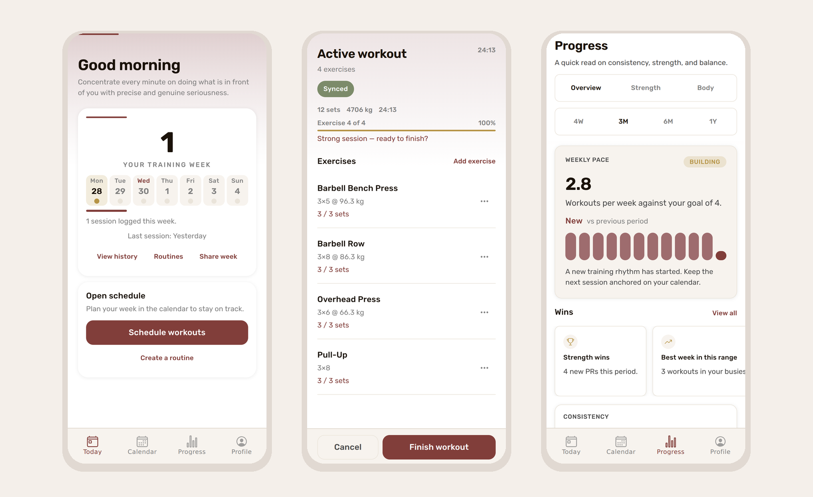
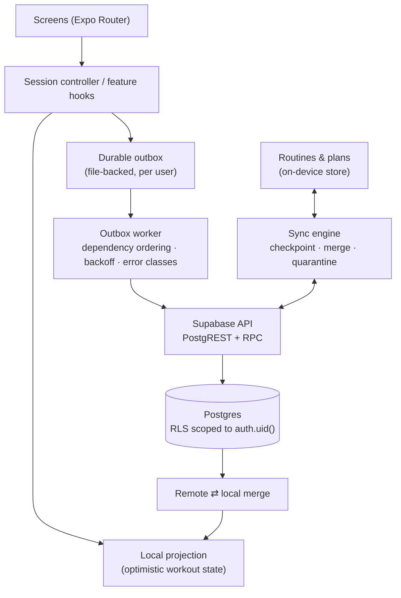
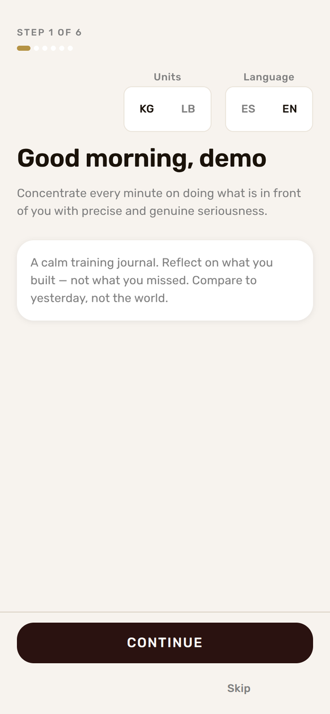
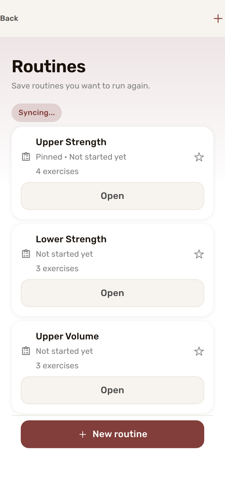
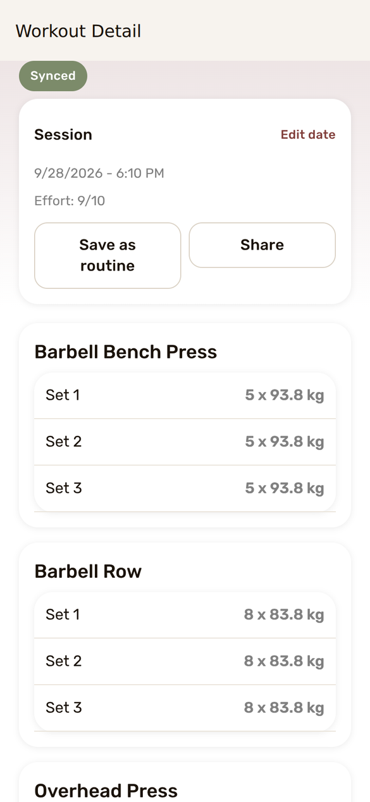

# Overflow

**An offline-resilient iOS training app built with Expo and Supabase: a dependency-aware sync outbox, row-level data isolation, program progression and release-grade quality gates.**

  



<sub>All screenshots use synthetic demo data. See [Screenshots](#screenshots) for how they were produced.</sub>

## What it does

Overflow is a strength-training journal for iPhone. You build routines, schedule them on a calendar, log sets during a session, and review progress over weeks and months. The product tone is deliberately calm: it compares you with your own recent training, not with other people.

- **Today**: the week at a glance, the planned session, and a single primary action (start, resume or schedule).
- **Workout sessions**: set-by-set logging with rest timers, supersets, set types, RIR and effort rating. Sets are recorded locally first, so the session keeps working through backgrounding, app restarts and lost connectivity.
- **Routines and programs**: reusable routines, program templates and suggested next weights.
- **Calendar**: month planning, scheduled routines, and optional one-way mirroring to Google Calendar.
- **Progress**: weekly pace against a goal, strength volume, muscle balance, estimated 1RM trends, PRs and "wins".
- **Account lifecycle**: email/password and Google sign-in, password reset, onboarding, and in-app account deletion.

## The engineering problem

A gym is a bad network environment. People log sets in basements and on flaky mobile data, then lock the phone for two minutes between sets. A training app that loses a set, duplicates a workout or shows a spinner mid-session fails its one job.

So the core rule is: **the user never waits on the network to record training.** Every mutation is applied locally first and reconciled with the server later, without losing ordering, duplicating rows or leaking one user's data to another.

## Architecture



- `app/`: Expo Router screens. Screens never call Supabase directly ([data/auth contract](docs/architecture/DATA_AUTH_CONTRACT.md)).
- `src/db/`: the typed data-access layer: workouts, routines, schedule, progress and account.
- `src/features/`: feature modules (sync, workout session, programs, calendar, progress, Google Calendar, trophies, onboarding).
- `supabase/`: schema, RLS policies and 44 versioned migrations.
- `scripts/`: contract, auth and release-config verification used by CI and pre-release checks.

→ [Feature map](docs/architecture/FEATURE_MAP.md)

## Offline and sync model

Workout writes (`create_workout`, `upsert_exercise`, `upsert_set`, `finish_workout`, …) go through a **durable outbox** in [`src/features/sync/outbox/`](src/features/sync/outbox):

| Concern          | How it is handled                                                                                                                       |
| ---------------- | --------------------------------------------------------------------------------------------------------------------------------------- |
| Durability       | Queue and projection are persisted to files with backup copies, so a crash mid-write doesn't lose state.                                |
| Ordering         | A dependency index defers child events (sets, exercises) until their parent workout has synced.                                         |
| Retries          | Exponential backoff from 2 s, capped at 5 min.                                                                                          |
| Failure classes  | Errors are classified. Auth errors pause the whole flush (the token may refresh); network, timeout, rate-limit and server errors retry. |
| Giving up safely | After 25 attempts or 20 minutes (auth-paused events exempt), an event is marked `blocked` and surfaced rather than retried forever.     |
| Compaction       | Events made redundant by a cancelled workout or a deleted set are dropped before flushing.                                              |
| Idempotency      | Client-generated UUIDs on every row, and upserts keyed on them. Server-side completion calls are idempotent.                            |
| Conflicts        | Remote and local workout state is merged per exercise and per set, so neither side's unsynced sets are dropped.                         |

Routines and schedules use a separate [sync engine](src/features/sync/routinesPlans) with a per-user lock, push checkpoints, content hashing and last-writer-wins merging by `updatedAt`. Invalid remote records are quarantined instead of crashing the client.

Evidence for these paths is in the tests (`__tests__/`, `src/features/sync/outbox/__tests__/`). The Maestro flows include an **offline workout sync** golden path ([`maestro/flows`](maestro/flows)).

## Authentication and data isolation

- Supabase Auth with email/password and **Google sign-in via PKCE** (`exchangeCodeForSession`). Redirect URIs are centralised in [`src/config/authRedirects.ts`](src/config/authRedirects.ts), and a verification script fails release preflight if one is hardcoded elsewhere.
- Sessions are stored in the iOS Keychain (`expo-secure-store`, `WHEN_UNLOCKED_THIS_DEVICE_ONLY`).
- **Row-level security** is enabled on every user-scoped table, with policies scoped to `auth.uid()`. The client only ever holds the anon key, and `check:env` hard-fails if a service-role key appears in the app environment.
- Multi-step server operations (starting a workout from a routine or a scheduled day, scheduling a routine, deleting an account) run as Postgres RPCs, so each is a single atomic call.

## Programs and progression

Program templates are validated in code ([`src/programs/`](src/programs)). After each session, [`progression.ts`](src/features/programs/progression.ts) suggests the next load from the completion ratio of the previous session (**increase / hold / reduce**), using plate-aware increments: 2.5 kg for compound lifts, 1.25 kg for accessories, with a pound equivalent.

Training analytics definitions (training load, e1RM method, muscle mapping) are recorded as ADRs in [`docs/adr/`](docs/adr).

## Integrations

- **Google Calendar**: one-way mirroring of scheduled workouts into a calendar the user picks. The app stays the source of truth. The feature sits behind a build flag and a configuration gate, so a misconfigured build never shows a broken entry point. → [docs](docs/google-calendar-sync/README.md)
- **Notifications**: local reminders with permission handling and user preferences.
- **Localization**: English and Spanish, including translated exercise names.
- **Observability**: Sentry crash reporting with release identity, plus PostHog product analytics keyed by user ID only, never email or other PII (optional; the app works without it). → [docs](docs/OBSERVABILITY.md)
- **Accessibility**: labelled controls and a written [accessibility checklist](docs/ACCESSIBILITY_CHECKLIST.md).

## Testing and evidence

Measured on this repository with `npm test` (Jest, `jest-expo`):

| Check                                              | Result                                               |
| -------------------------------------------------- | ---------------------------------------------------- |
| Unit and integration tests                         | **784 passed, 0 skipped, 0 failed** (113 test files) |
| Typecheck (`tsc --noEmit`)                         | passes                                               |
| ESLint (`--max-warnings=0`)                        | passes                                               |
| No-new-lint-debt and no-hardcoded-colour checks    | pass                                                 |
| Prettier                                           | passes                                               |
| Supabase contract verification (code ⇄ migrations) | passes                                               |
| Auth contract verification                         | passes                                               |
| iOS JS bundle (`expo export --platform ios`)       | builds                                               |

CI ([`quality-gates.yml`](.github/workflows/quality-gates.yml)) runs formatting, governance, Supabase contract, lint-debt and design-token checks, typecheck and the full test suite on every push and pull request (plus lint on touched files for pull requests). The full `eslint --max-warnings=0` run and `verify:auth` are part of the release preflight. End-to-end Maestro flows on an iOS simulator (login → routine → schedule → workout → progress, offline sync, session "torture" test) run manually against a dedicated E2E Supabase project. → [docs/E2E_GOLDEN_FLOWS.md](docs/E2E_GOLDEN_FLOWS.md)

## Screenshots

| Onboarding                                     | Routines                                   | Workout detail                                         |
| ---------------------------------------------- | ------------------------------------------ | ------------------------------------------------------ |
|  |  |  |

<sub>These are the app's real screens, rendered with React Native Web from this codebase against a mocked Supabase API that serves synthetic data (a demo user with 12 weeks of workouts). No real accounts, workouts, emails or device identifiers appear. The shipping target is iOS, so native details such as fonts and safe areas differ slightly on device.</sub>

## Tech stack

Expo SDK 54 · React Native 0.81 · React 19 · Expo Router 6 · TypeScript 5.9 · Supabase (Postgres, Auth, RPC, RLS) · TanStack Query · Shopify Restyle · expo-secure-store · expo-file-system · expo-notifications · expo-localization · Sentry · PostHog · Jest · Maestro · EAS Build / Submit · GitHub Actions

## Local setup

Requires Node 20 (see `.nvmrc`) and a Supabase project of your own.

```bash
npm ci
cp .env.example .env          # fill in your Supabase URL and anon key
npm run check:env:local
npm run ios                   # start Expo and open the iOS simulator
```

Apply the schema in `supabase/` (schema, policies and migrations) to your project. Verification without a device:

```bash
npm test && npm run typecheck && npm run lint && npm run db:verify:contract
```

→ [docs/ENVIRONMENT.md](docs/ENVIRONMENT.md) · [docs/EAS_SETUP.md](docs/EAS_SETUP.md)

## Release status

The March 2026 release-hardening audit ([launch candidate status](docs/release/LAUNCH_CANDIDATE_STATUS.md)) concluded **READY FOR INTERNAL BETA / TESTFLIGHT**, with all quality gates passing and no silent save failures found in the audited flows.

That is not the same as a public App Store release. Internal beta readiness means the build is fit for a small invited group of testers through TestFlight. A production release would still need broader device and network testing, App Store review, and operational readiness (support, monitoring thresholds, incident process). The app has **not** been publicly launched. → [TestFlight go/no-go](docs/TESTFLIGHT_GO_NO_GO.md) · [open-beta checklist](docs/release/OPEN_BETA_CHECKLIST.md)

## Limitations

- iOS only. The code is cross-platform React Native, but Android hasn't been built or tested.
- Google Calendar sync is one-way (app → calendar).
- Sync is last-writer-wins for routines and plans. There is no collaborative editing or field-level conflict UI.
- E2E flows need a dedicated Supabase project and a macOS runner, so they aren't part of per-push CI.
- Outbox events that are still unsynced 20 minutes after they were queued (auth pauses excepted) are marked `blocked` and aren't retried automatically. The data stays on the device and the block is shown to the user, but work from a long offline session can stay unsynced, because there is no automatic recovery path for blocked events yet. Measuring that age from the last attempt instead of creation is the obvious next fix.
- It has no users beyond the developer and test accounts, so no usage or retention data exists.

## Security

The client only ever uses the Supabase anon key, and data access is enforced by row-level security. See [SECURITY.md](SECURITY.md) for the security posture and how to report a vulnerability.

This public repository was published with fresh Git history. Local tooling configuration, internal development notes and environment files are not included.

## License

[MIT](LICENSE) © Raul Mermans
